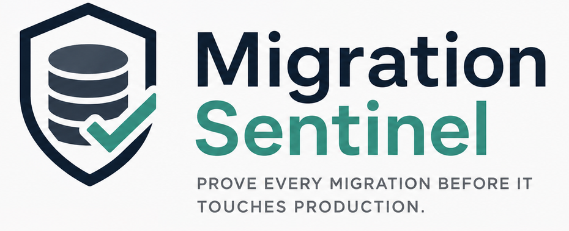
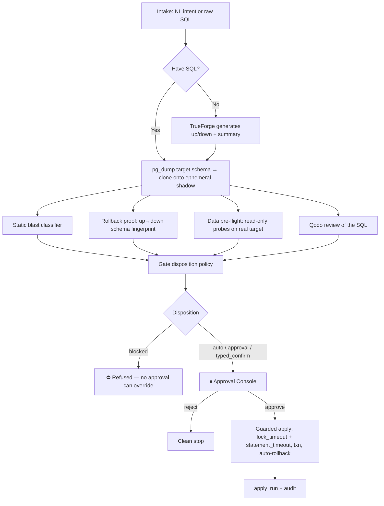
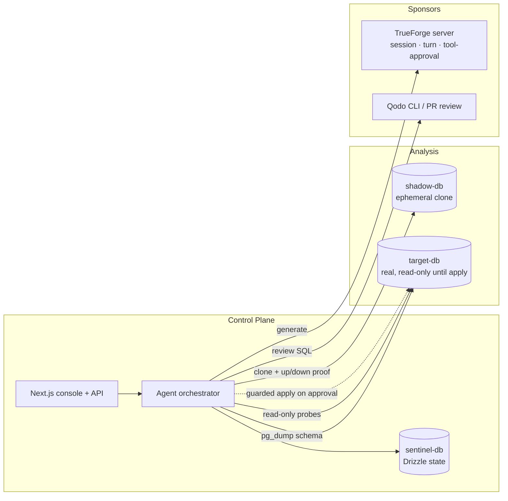
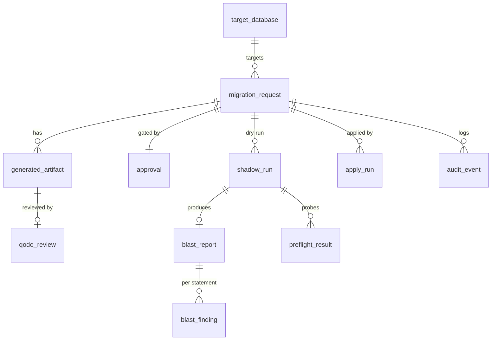

<p align="center">
  
</p>

<p align="center"><b>An AI agent that plans, dry-runs, and applies PostgreSQL schema migrations — and physically stops for a human before anything irreversible.</b></p>

[](https://github.com/SamChawla/migration-sentinel/actions/workflows/ci.yml)


Built for the **TrueForge Agent Harness Hackathon** (WeMakeDevs × TrueFoundry). The agent runs on TrueForge; every migration travels one pipeline; nothing skips the gate.

<p align="center">
  
</p>

> **▶ Run it locally in ~5 minutes** — install, seed, and log in with one click:
> **[GETTING_STARTED.md](GETTING_STARTED.md)**.

---

## Table of Contents

- [Why Migration Sentinel](#why-migration-sentinel)
- [What only we do](#what-only-we-do)
- [The pipeline](#the-pipeline)
- [The gate — four dispositions](#the-gate--four-dispositions)
- [How the shadow works (and what it costs)](#how-the-shadow-works-and-what-it-costs)
- [Operator workflow — environments, GitHub & retry](#operator-workflow--environments-github--retry)
- [Architecture](#architecture)
- [Control-plane schema](#control-plane-schema)
- [HTTP API](#http-api)
- [Tech stack](#tech-stack)
- [Getting started](#getting-started)
- [Environment variables](#environment-variables)
- [Tests, CI & coverage](#tests-ci--coverage)
- [Project structure](#project-structure)
- [Safety & control](#safety--control)
- [Qodo review proof](#qodo-review-proof)
- [AI assistance declaration](#ai-assistance-declaration)
- [Built with](#built-with)

---

## Why Migration Sentinel

Schema migrations are the single most dangerous routine operation in software. One bad `ALTER TABLE` takes an exclusive lock and stalls every query; a missing `WHERE` rewrites millions of rows; a `DROP COLUMN` shipped without a rollback is unrecoverable. Yet the "review" is still a human squinting at a PR diff and hoping.

The tools you already use — **Alembic, Drizzle Kit, Flyway, Liquibase** — *author*, *version*, and *apply* migrations. They execute exactly what you wrote. None of them tell you what a migration will **do** to production before it runs, none **prove** the rollback works, and none **pause for a human** at the irreversible moment.

> **Alembic is `git commit`. Migration Sentinel is the CI + code review + "are you sure?" gate that runs before that commit hits production.**

We're the **analyze → prove → gate** layer in front of whatever you use to apply. We can even emit an Alembic/Drizzle migration file as output.

## What only we do

| # | Capability | Type |
|---|---|---|
| 1 | **Blast radius before prod** — rows affected, lock type, downtime estimate from the target's own planner statistics | ⚙️ Deterministic |
| 2 | **Rollback proven, not assumed** — apply `up`→`down` on a shadow, verify the schema returns, and flag data-loss *honestly* | ⚙️ Deterministic |
| 3 | **A human gate keyed to danger** — irreversible ops require a typed confirmation; the gate is enforced *independently of the agent* | ⚙️ Deterministic |
| 4 | **Data pre-flight** — exact read-only probes on the real target catch data-dependent failures (`SET NOT NULL` on NULL rows, dup `UNIQUE`, …) | ⚙️ Deterministic |
| 5 | **Authoring from intent** — plain-English or raw SQL → a safe `up`/`down` pair | 🤖 Model (TrueForge) |
| 6 | **Advisory code review** — Qodo reviews the generated migration SQL | 🤖 Model (Qodo) |

The model **proposes**; deterministic policy **disposes**. The severity, the rollback verdict, and the gate decision are all machine-computed — never chosen by the LLM.

## The pipeline

<p align="center">
  
</p>

Every request travels the same path. The agent orchestrates it and then **physically pauses** at the gate — the apply tool cannot run until a human decision is recorded in our own database.



## The gate — four dispositions

The disposition is computed deterministically from severity + whether a whole-dataset destruction is present + whether the data pre-flight will/can't-be-proven pass.

| Disposition | When | What the human can do |
|---|---|---|
| `auto` | green & recoverable | Approve normally |
| `approval` | amber (locking / slow) | A human approves — no typed confirmation |
| `typed_confirm` | red-but-recoverable, scoped irreversible loss, or data that will/can't-be-proven pass | Type the **exact** affected table name to assume responsibility |
| `blocked` | whole-dataset destruction, no recovery path (`DROP TABLE`, `TRUNCATE`, unbounded `UPDATE`/`DELETE`) | **Nothing** — Sentinel refuses to apply; even human approval cannot override. Remedy is a bounded/reversible replacement |

`blocked` is re-derived from the SQL of record at the gate **and again** inside the apply executor — it is a system property, not a stored flag the agent could tamper with.

## How the shadow works (and what it costs)

We do **not** clone production data (slow, expensive, a privacy problem). Two cheap, independent signals instead:

1. **Schema-only shadow** — a live `pg_dump --schema-only` of the target is cloned into a tiny ephemeral Postgres. We run `up`→`down` on it to prove the migration is valid and the rollback restores the schema. **Zero rows moved.**
2. **Data pre-flight on the real target** — for data-dependent operations we run an **exact, read-only** aggregate probe against the target (e.g. `SELECT count(*) FROM users WHERE legacy_notes IS NULL`) with a hard `statement_timeout`, so we know *before* the gate whether existing data will block the migration.

> Honest limitation: row/downtime figures are **planner estimates, not measured truth** — enough to catch "this rewrites the whole table," never claimed as exact.

## Operator workflow — environments, GitHub & retry

The core pipeline is the same everywhere; these are the operational layers around it.

**Environment ladder — `local → dev → staging → prod`.** A change climbs one rung at a
time and the gate gets *stricter* as it climbs, never looser. From an **applied**
request the promotion rail clones the migration one rung up — same
`promotion_group_id`, same SQL — and re-runs the **full** analysis against the next
environment (its own shadow, blast report, and gate). When more than one connection
exists for the next environment, the rail lets you **pick the target**. **Prod is
locked** until the *same* SQL (normalized) has reached `applied` on a lower rung — a
lock enforced server-side in `promotionEligible`, not just in the UI. `docker compose`
brings up **dev (:5437), staging (:5436), and prod (:5433)** target databases, and the
seed registers `dev-orders-db` / `staging-orders-db` / `prod-orders-db` so the whole
ladder is runnable end-to-end.

**GitHub PR intake + a two-gate export.** Point Sentinel at a PR that changes a `.sql`
file: it re-reads the file **server-side at the PR head SHA** (never trusting SQL the
browser sends), analyzes it, and can post the verdict back as a PR comment. For a
prod-bound change on a linked repo, approving at the Sentinel gate **exports** the
migration as a pull request (`up.sql` / `down.sql` / `report.md`) instead of applying;
the **merge** of that PR — a human action on GitHub — is gate 2, and only a
live-verified merge unlocks the guarded apply. `pnpm sample:pr <owner/repo>` opens a
ready-made sample PR (a green index + a red drop) to exercise this path.

**Retry.** A run that **fails** before the gate — or is genuinely **stranded** in a
pre-apply state after a crash/restart — can be re-run from the console: it resets to
`received` and re-runs the full analysis. Nothing was applied, so re-analyzing is
safe. Two guards keep it honest: a failure that reached the **apply stage** (the target
may have partially changed) is refused and flagged for manual reconciliation, and a
stuck-run is only reclaimable after a no-activity window measured against the pipeline's
own audit-event heartbeat — a live run is never yanked out from under itself.

## Architecture



The **only** code path that writes the target is the guarded apply executor, and it independently re-asserts the gate before it runs.

## Control-plane schema

Normalized state in our own Postgres (Drizzle). The `audit_event` table is append-only.



## HTTP API

| Method | Path | Purpose |
|---|---|---|
| `GET` | `/api/requests` | List all migration requests (hydrated, server-side search/sort/paging) |
| `POST` | `/api/requests` | Create a request (NL intent · raw SQL · GitHub PR) → fires the live pipeline |
| `GET` | `/api/requests/[id]` | Full request detail for the console |
| `POST` | `/api/requests/[id]/retry` | Reset a failed/stranded request → re-run the pipeline (guarded) |
| `POST` | `/api/requests/[id]/promote` | Clone the request one rung up the env ladder → re-analyze |
| `POST` | `/api/requests/[id]/apply` | Guarded apply (also the merge-verified prod release, gate 2) |
| `POST` | `/api/requests/[id]/github/refresh` · `/github/comment` | Sync PR state · post the verdict comment |
| `POST` | `/api/requests/[id]/chat` | Read-only "Ask about this migration" copilot (BYOK) |
| `POST` | `/api/approvals` | **The gate** — record decision, run independent check, drive guarded apply/export |
| `GET` `POST` `PATCH` | `/api/connections` | List · add-&-test · re-tag the target databases |
| `GET` | `/api/github/pr` | Look up a PR + its changed `.sql` files for the intake |
| `GET` | `/api/stream/[id]` | SSE stream of shadow + apply logs |
| `POST` | `/api/auth/login` · `/api/auth/logout` | Single-approver session |

## Tech stack

| Layer | Technology |
|---|---|
| Language | TypeScript (ESM), pnpm workspaces |
| Agent harness | **TrueForge** (`@truefoundry/trueforge-sdk`) — sessions, turn streaming, tool-approval HITL |
| Code review | **Qodo** — GitHub App (`/agentic_review` on PRs) + `@qodo/command` CLI for in-app SQL review |
| Web | Next.js 15 (App Router), React 19 |
| State | Drizzle ORM + PostgreSQL 16 |
| DB access | `pg` (node-postgres) |
| Shadow | Docker Postgres + native `pg_dump` (schema-only) |
| Tests | Vitest |

## Getting started

**Full walkthrough (prereqs, env, copilot, troubleshooting): [GETTING_STARTED.md](GETTING_STARTED.md).** The short version:

```bash
pnpm install
cp .env.example .env                          # scripts / agent / CLI
cp apps/web/.env.example apps/web/.env.local  # the running web app (Next reads this one)
docker compose up -d                          # sentinel :5435 · prod :5433 · staging :5436 · dev :5437 · shadow :5434
pnpm --filter @sentinel/db migrate            # control-plane tables
pnpm db:seed                                  # seed target-db with users/orders (~50k / ~115k rows)
pnpm db:seed:sentinel                          # seed the console with demo migration requests (dev/staging/prod)
pnpm dev                                      # control plane + Approval Console (:3000)

# Optional — only needed to generate SQL from an English intent:
npx @truefoundry/trueforge                    # TrueForge server (:8790), with a model-provider key

# Optional — open a sample PR to demo the GitHub-PR intake (needs GITHUB_TOKEN):
pnpm sample:pr <owner/repo>                    # commits fixtures/sample-pr/*.sql and opens one PR
```

> Re-seeding is guarded: the control-plane seed refuses to overwrite existing rows.
> Pass `--reset` to wipe and reseed — `pnpm db:seed:sentinel -- --reset`.

Then open **http://localhost:3000** and click **Login to Console** — the demo token is pre-filled, so one click lands you on the dashboard and starts the guided walkthrough.

Raw-SQL intake runs the whole pipeline **live** — shadow dry-run, rollback proof, pre-flight, gate, guarded apply — with **no** model or TrueForge server required. TrueForge + a model key are only for the *generate-from-intent* step.

Verify the safety core (the pure classifier/gate/guard tests run with zero external
deps; the rollback + provisioning tests use the ephemeral shadow above):

```bash
pnpm test                            # 234 passing
pnpm test:coverage                   # + v8 coverage report
pnpm typecheck                       # packages + web app
```

## Environment variables

| Variable | Needed for |
|---|---|
| `DATABASE_URL` | Control-plane Postgres (sentinel-db) |
| `TARGET_DB_URL` | The prod database being migrated (read-only until apply) |
| `STAGING_DB_URL` · `DEV_DB_URL` | Lower rungs of the promotion ladder — seeded as `staging-orders-db` / `dev-orders-db` |
| `SHADOW_ADMIN_URL` | Admin conn that can `CREATE`/`DROP` ephemeral shadow DBs |
| `SHADOW_DATABASE_URL` | A throwaway shadow DB — used by the live rollback tests / CI |
| `APPROVER_TOKEN` | The single-approver login token (the Approval Console validates it) |
| `APPROVER_IDENTITY` | Server-set actor recorded in the audit log (default `approver`) |
| `TRUEFORGE_BASE_URL` | TrueForge server (default `http://localhost:8790`) |
| `TRUEFORGE_TOKEN` | *Only* for a hosted/auth-enabled TrueForge (local server needs none) |
| `ANTHROPIC_API_KEY` | The model-provider key the TrueForge server uses to generate SQL |
| `QODO_API_KEY` | In-app Qodo CLI review (unset → review is skipped, pipeline still runs) |
| `GITHUB_TOKEN` | GitHub PR intake, verdict comments, and the export-PR gate (`repo` scope); also used by `pnpm sample:pr` |
| `EURON_API_KEY` | The read-only "Ask about this migration" copilot (OpenAI-compatible / Euron; unset → copilot disabled) |
| `EURON_BASE_URL` · `EURON_MODEL` | Copilot endpoint + model (default `…/api/v1/euri`, `gpt-4.1-nano`) |
| `NEXT_PUBLIC_DEMO_TOKEN` | Demo only — pre-fills the login token for one-click "Login to Console". Leave unset in production |
| `PG_DUMP` | Override the `pg_dump` path if not auto-found |

> Next reads `apps/web/.env.local`, **not** the repo-root `.env` — mirror the DB URLs there for the running app.

## Tests, CI & coverage

```bash
pnpm lint            # ESLint — correctness rules (dead code, real bugs), not formatting
pnpm test            # 234 passing (Vitest; 8 live-DB tests self-skip without a shadow URL)
pnpm test:coverage   # v8 coverage over the deterministic safety core
pnpm typecheck       # tsc --noEmit over packages + the Next.js app
```

**234 passing** across the deterministic safety core (242 total; the 8 live-shadow
tests self-skip when `SHADOW_DATABASE_URL` is unset, and run in CI):

| Suite | Tests | What it proves |
|---|---:|---|
| `shadow/qodo-fixes` | 49 | regression tests for every review round (each finding gets a test) |
| `shadow/blast` | 32 | statement classifier + SQL lexer (strings, dollar-quotes, nested comments, E-strings) |
| `shadow/query` | 24 | read-only guard (advisory locks, `set_config`, backend signals, `dblink`, …) |
| `agent/apply` | 23 | autocommit detection + `findExecutorSubversion` (txn/timeout/2PC contract) |
| `core/environment` | 22 | the promotion ladder — env-scaled gate, prod lock, SQL normalization |
| `agent/github` | 12 | GitHub client (PR read, files, checks, refs/PR export helpers) |
| `shadow/preflight` | 12 | exact data-dependent probes (NOT NULL, UNIQUE, CHECK, FK, PK, EXCLUDE) |
| `qodo` | 12 | verdict JSON extraction + skip/degradation contract |
| `core/disposition` | 11 | the four-way gate policy |
| `agent/apply-session` | 10 | the TrueForge tool-approval leg (pause capture + resolve, degrades safely) |
| `shadow/introspect` | 7 | live-schema introspection for the honest ERD |
| `agent/exportPr` | 7 | the two-gate export (branch/commit/PR, slug + folder shaping) |
| `shadow/rollback` | 7 | **live** shadow: `up`→`down` schema-fingerprint proof (real Postgres) |
| `core/github-report` | 5 | the verdict-comment markdown |
| `agent/generate` | 5 | resilient `{up,down}` JSON extraction |
| `shadow/provision` | 4 | `sanitizeDump` (dollar-quote-aware pg_dump post-processing) |

Coverage of the safety core (`@vitest/coverage-v8`): **~68% lines/statements, ~88% branches**.
The lower line figure is honest — the guarded-**apply execution** and the network/CLI
clients (TrueForge, `pg`, `pg_dump`, the Qodo CLI) are exercised **live** by
`scripts/smoke_live.ts` (full intake → gate → guarded apply end-to-end against the
real databases), not by unit tests.

**CI** ([`.github/workflows/ci.yml`](.github/workflows/ci.yml)) runs on every push/PR:
it provisions three Postgres 16 services mirroring `docker-compose`, then runs
`pnpm lint`, `pnpm typecheck` and `pnpm test:coverage` — so the **live rollback +
provisioning tests actually run in CI**, not self-skip.

Contributing (PR-first, Qodo-reviewed workflow): see [CONTRIBUTING.md](CONTRIBUTING.md).

## Project structure

```
apps/web/            Next.js control plane — API routes + Approval Console + /demo replay
packages/
  core/              shared types · request state machine · independent gate · disposition policy · audit
  db/                Drizzle schema + query layer (the control-plane state)
  shadow/            blast classifier · rollback verifier · data pre-flight · read-only query guard · shadow provisioning + pg_dump
  agent/             TrueForge client + approval loop · generation · orchestrator · guarded apply · safety pipeline · Day-1 spike
  qodo/              Qodo review client (@qodo/command CLI)
fixtures/            demo target schema · the migration corpus · sample-pr/ (GitHub-intake demo)
scripts/             seed.ts · seed-sentinel.ts · smoke_live.ts · verify_blast.ts · open-sample-pr.ts · load-env.ts
.github/workflows/   ci.yml — typecheck + tests + coverage against live Postgres services
```

Meaningful code landed via a **native stacked-PR** set (`feat/foundations` →
`feat/core-db` → `feat/safety-core` → `feat/agent-qodo` → `feat/web-console` →
`feat/scripts`), each reviewed by the Qodo GitHub App and re-reviewed until clean
before merge.

## Safety & control

- **Runs code somewhere safe** — the migration executes first on an **ephemeral, schema-only shadow**, never on prod, during analysis.
- **Stops before anything irreversible** — the agent reaches `awaiting_approval` and does **not** call the apply tool; a human decides.
- **The gate is a system property** — the apply executor calls `assertApproved()` against the database of record and re-derives `blocked` from the SQL; the model cannot self-approve, and a blocked migration can't be pushed through even with human approval.
- **Guarded apply** — `SET lock_timeout` + `statement_timeout`, single transaction, auto-`ROLLBACK` on error/timeout, and an `apply_run` + audit row.
- **Least privilege** — the target is read-only until the approved apply; the NL query box is SELECT-only, enforced four independent ways.

## Qodo review proof

Every pull request in this repo was reviewed by the **Qodo GitHub App**
(`qodo-code-review[bot]`), triggered with a `/agentic_review` PR comment and
re-reviewed after each push until clean. The review trail — inline findings, our
inline replies, and a `## Qodo Fix Summary` comment per round — lives in the PR
threads themselves.

The migration was delivered as reviewed, **merged** pull requests:

| PR | What it delivered | Qodo |
|---|---|---|
| [#1–#6](https://github.com/SamChawla/migration-sentinel/pulls?q=is%3Apr+is%3Amerged) | The core stack (foundations → control-plane → safety core → agent+Qodo → web console → scripts) | **13 review rounds**, converging 43 → … → 0 open before merge |
| [#22](https://github.com/SamChawla/migration-sentinel/pull/22) · [#23](https://github.com/SamChawla/migration-sentinel/pull/23) · [#24](https://github.com/SamChawla/migration-sentinel/pull/24) · [#25](https://github.com/SamChawla/migration-sentinel/pull/25) · [#26](https://github.com/SamChawla/migration-sentinel/pull/26) | TrueForge apply-gate leg · promotion ladder · live introspection · PR intake · two-gate export | Reviewed + resolved per PR |
| [#27](https://github.com/SamChawla/migration-sentinel/pull/27) · [#28](https://github.com/SamChawla/migration-sentinel/pull/28) | Deploy configs + ladder UI · resolve the #27 review findings | Reviewed + resolved |
| [#29](https://github.com/SamChawla/migration-sentinel/pull/29) | Retry · promotion target picker · dev rung · sample PR | 6 findings — [5 fixed, 1 declined with rationale](https://github.com/SamChawla/migration-sentinel/pull/29#issuecomment-5467450177) |

The in-app Qodo CLI review (`@qodo/command`, which scores the generated migration
SQL inside the pipeline) is a **bonus** integration on top of this mandatory PR flow.

## AI assistance declaration

This project was built with AI assistance, disclosed here in full:

- **Claude Code** (Anthropic) was used as an assisted LLM / pair-programmer throughout —
  scaffolding, implementation, test authoring, and working through code-review findings.
  Architecture, the safety model, and every design decision were human-directed, and the
  **deterministic safety core** (the blast classifier, rollback proof, data pre-flight, the
  four-way gate policy, and the independent apply guard) is human-designed policy that the
  model is deliberately kept *out* of — the model proposes, deterministic code disposes.
- **TrueForge** (TrueFoundry) is the agent runtime that executes the generation turn and the
  tool-approval gate.
- **Qodo** is the AI code reviewer that reviewed every PR (see above).
- **Euron** (OpenAI-compatible) powers the optional read-only "Ask about this migration" copilot.

Commit authorship is the human author's; AI assistance is disclosed here rather than in
individual commit trailers.

## Built with

TrueForge (agent harness), Qodo (code review), Drizzle + PostgreSQL, Next.js, and Claude Code. The safety core is deterministic and unit-tested; the model is used where judgment helps (authoring) and kept away from where it must not (the gate).

## License

[MIT](LICENSE) © 2026 Migration Sentinel.
